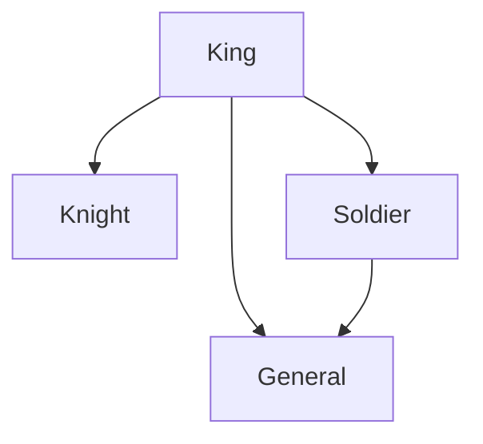
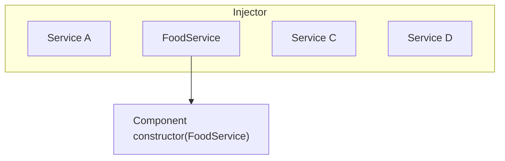

# Dependency Injection

---

# რა არის Dependency Injection?

DI არის დიზაინის პატერნი, სადაც:

- კოდის ნაწილები დაყოფილია დანიშნულების მიხედვით კლასებად, ობიექტებად და ფუნქციებად;
- თუკი ერთი კლასის დანიშნულება რაიმე სხვა კლასს სჭირდება, იგი მასზე დამოკიდებულებას აცხადებს;

უპირატესობები:

- კოდის ლოგიკური ნაწილები განცალკევებულია (decoupled);
- კოდი აბსტრაქტულია: აღწერს რას აკეთებს და რა ინტერფეისის კლასები (dependency-ები) სჭირდება, რომ სწორად იმუშაოს.
- მოქნილობა: ნებისმიერი dependency ჩანაცვლებადია იმავე ინტერფეისის სხვა dependency-ით;
- ტესტირებადობა: ჩანაცვლების საშუალებით შეგვიძლია კოდის სხვადასხვა ნაწილები ტესტისთვის გათვლილი dependency-ებით გავტესტოთ.

---

```ts
class Knight {
  defend() {
    return "defend the ruler";
  }
}
class General {
  command(orders?: string) {
    return "General commands: " orders || "Do as I say!";
  }
}
```

```ts
class Soldier {
  general: General;
  orders = "no orders for now";
  constructor() {
    this.general = new General();
    this.orders = this.general.command();
  }
}
```
```ts
const soldier1 = new Soldier();
const soldier2 = new Soldier();
const soldier3 = new Soldier();
```

```ts
console.log(soldier1.general === soldier2.general);
```

---

# DI-ს Singleton პატერნი

Dependency-ს ამოცხადება

```ts
class Soldier {
  orders = "no orders for now";
  constructor(public general: General) {
    this.orders = this.general.command();
  }
}
```

შექმნა და dependency-ს მიწოდება

```ts
const general = new General();
const soldier1 = new Soldier(general);
const soldier2 = new Soldier(general);
const soldier3 = new Soldier(general);
```

One general to rule them all

```ts
console.log(soldier1.general === soldier2.general);
```

---

# მრავალი dependency

```ts
class King {
  constructor(
    public knight: Knight,
    public general: General,
    public soldier: Soldier
  ) {}

  order() {
    this.soldier.orders = this.general.command("Protect the kingdom!");
  }
}
```

```ts
const knight = new Knight();
const general = new General();
const soldier = new Soldier(general);
const king = new King(knight, general, soldier);
```

---
layout: two-cols
---

# Dependency Graph



::right::

<br>
<br>

```ts
const knight = new Knight();
const general = new General();
const soldier = new Soldier(general);
const king = new King(knight, general, soldier);
```

გენერალი აქაც singleton არის

```ts
console.log(king.general === soldier.general);
```

---
layout: two-cols
---

# ჩანაცვლება

```ts
interface Commander {
  command: () => string;
}

class Soldier {
  orders = "no orders for now";
  constructor(public commander: Commander) {
    this.orders = this.commander.command();
  }
}

class General implements Commander {
  command() {
    return "Here are your orders!";
  }
}

class SubstituteGeneral implements Commander {
  command() {
    return "Different orders!";
  }
}
```

::right::

<div class="pl-4 mt-14">

`Soldier` გამოიყენებს ნებისმიერ ობიექტს, რომელიც `Commander` ინტერფეისს შეესაბამება.

```ts
const general = new General();
const substituteGeneral = new SubstituteGeneral();

const soldier1 = new Soldier(general);
const soldier2 = new Soldier(substituteGeneral);

console.log(soldier1.orders); // Here are your orders!
console.log(soldier2.orders); // Different orders!
```

აი ამას ჰქვია აბსტრაქტულობა!

</div>

---

# DI ანგულარში

ანგულარი თვითონ  DI-ით არის აწყობილი და ჩვენც საშუალებას გვაძლევს
დეკორატორებით შექმნილ კლასებში (კომპონენტებში, დირექტივებში და ა.შ)
კონფიგურაცია გავუკეთოთ dependency-ებს.

DI სისტემის ორი როლი:

- კონსუმერი (მიმღები)
- პროვაიდერი (მიმწოდებელი)

ანგულარი იყენებს `Injector`-ს რათა თავი მოუყაროს dependency-ებს ერთ რეგისტრში,
ან - თუ ისინი არ არსებობენ - შექმნას მათგან ახალ ინსტანციები და ისე მიაწოდოს
კონსუმერებს. `Injector` არის სისტემა რომელიც აკავშირებს პროვაიდერებსა და კონსუმერებს
(ანუ ჩვენ ხელით არ გვიწევს კლასების შექმნა და კონსტრუქტორში dependency-ების მიწოდება).

---

# dependency-ების მიწოდება

`@Injectable` დეკორატორი კონფიგურაციას უკეთებს კლასს, რომელიც შეგვიძლია **დავაინჯექთოთ**
სხვა კლასში.

```ts
// ფაილი food.service.ts
@Injectable()
export class FoodService {
  getFood() {
    return "Piping hot Khinkali!"
  }
}
```

> შენიშვნა: Injectable კლასებს კონვენციურად `Service` სუფიქსი აქვთ.

დეკორატორის გარდა საჭიროა ის DI სისტემაში ხელმისაწვდომი გავხადოთ
მისი **დაპროვაიდებით (provide)** სხვადასხვა დონეზე:

- აპლიკაციის ძირეულ დონეზე;
- კომპონენტის დონეზე;
- მოდულის დონეზე (თუ ვიყენებთ `NgModule`-ებს);

---

# დაპროვაიდება

**რეკომენდირებული გზა:** აპლიკაციის ძირეულ (root) დონეზე. ერთი სერვისის ინსტანცია მთელ აპლიკაციაში:

```ts {1-3}
@Injectable({
  providedIn: 'root'
})
class FoodService {}
```

კომპონენტის დონეზე. უნიკალური სერვისის ინსტანცია კომპონენტისთვის (და პოტენციურად მისი შვილებისთვის):

```ts {5}
@Component({
  standalone: true,
  selector: 'app-food-list',
  template: '...',
  providers: [FoodService]
})
class FoodListComponent {}
```

---

# დაინჯექთება და მოხმარება

კონსტრუქტორით

```ts
@Component({/*...*/})
export class FoodListComponent {
  constructor(private foodService: FoodService) {}
  deliverFood() {
    this.foodService.getFood();
  }
}
```

`inject()` ფუნქციით

```ts
@Component({/*...*/})
export class FoodListComponent {
  private foodService = inject(FoodService);
  deliverFood() {
    this.foodService.getFood();
  }
}
```

---

# `Injector`-ის რეგისტრი

როცა ანგულარი აღმოაჩენს, რომ კომპონენტი დამოკიდებულია სერვისზე,
ის ჯერ შეამოწმებს ინჯექტორი ინახავს თუ არა ამ სერვისის ინსტანციას.
თუ მოთხოვნილი სერვისი არ არსებობს, ის მას სექმნის დარეგისტრირებული
პროვაიდერის წყალობით და, სანამ ამ სერვისს დააბრუნებს, მას ინჯექტორში შეინახავს.

მას შემდეგ რაც ყველა მოთხოვნილი სერვისი მოიძებნება, ანგულარი კომპონენტებს შექმნის
კონსტრუქტორში მათთვის საჭირო სერვისების არგუმენტებად მიწოდებით.



---

# გაითვალისწინეთ

- ფაქტობრივად ყველა ანგულარის საშენი ბლოკების დაინჯექთება არის შესაძლებელი და არა მარტო `@Injectable` სერვისების.
- კლასის სახელი ანგულარში გამოიყენება **ტოკენად (token)** რომლითაც ანგულარი ცნობს რა ტიპის მონაცემი (კლასი) უნდა შეიქმნას, რათა dependency მიაწოდოს კონსუმერს, თუმცა ტოკენი შეიძლება იყოს უბრალო სტრინგი, რომლითაც შესაძლებელია ნებისმიერი სხვა მონაცემის სტრუქტურის დაბრუნება (არა მხოლოდ კლასის ინსტანციის), მაგ. მასივების, ფუნქციების, პრიმიტივების და ა.შ.
- პროვაიდერებს გააჩნიათ **იერარქია**. ანუ ანგულარი ზოგიერთი დონის პროვაიდერს მეტ პრიორიტეტს ანიჭებს.
- DI ელემენტარულ დონეზე მარტივი გამოსაყენებელია, თუმცა ვრცელი და კომპლექსური თემაა.

---
layout: image-right
image: "/frieren-ng-guide.webp"
---

<div class="h-full flex flex-col justify-center text-xl">

# შეკითხვები?

გმადლობთ...

</div>
